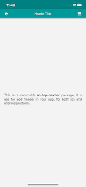
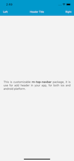
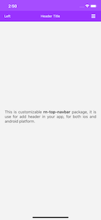
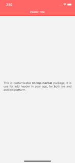
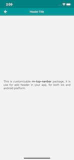

# React Native top-navbar🚀

[](<[https://www.npmjs.com/package/@mindinventory/rn-top-navbar](https://www.npmjs.com/package/@mindinventory/rn-top-navbar)>)


A **@mindinventory/rn-top-navbar** package is used to create custom navigation for React native apps.
Users can fully customize the navbar. you can change the background color of the status bar. Navigation can contain components like icons, images, and text.







### Installation

using npm:

```
npm install @mindinventory/rn-top-navbar
```

using yarn:

```
yarn add @mindinventory/rn-top-navbar
```

### Supported platform

- Android
- Ios

### Usage

```js
import Header from '@mindinventory/rn-top-navbar';
...
<Header style={{ backgroundColor: '#009999' }} statusBarBackground='#008080' barStyle='light-content'>
    <Header.Left style={{ backgroundColor: '#009999', width: "15%" }}>
        <Icon name='arrow-left' style={{color: '#fff', fontSize: 18}} />
    </Header.Left>
    <Header.Body style={{ backgroundColor: '#009999', width: "70%" }}>
        <Text style={{color: '#fff'}}>Header Title</Text>
    </Header.Body>
    <Header.Right style={{ backgroundColor: '#009999', flexDirection: 'row', width: '15%' }}>
        <Icon name='bars' style={{color: '#fff', fontSize: 18}} />
    </Header.Right>
</Header>
```

### Documentation

**Navbar container props**
| Prop | Type | description |
| --- | --- | --- |
| statusBarBackground | string | use for change background color of status bar. |
| barStyle | string | use for change content of status bar. |
| style | style | apply styles on navbar container. |

**Left container props**
| Prop | Type | description |
| --- | --- | --- |
| style | style | apply styles on left container. |

**Body container props**
| Prop | Type | description |
| --- | --- | --- |
| style | style | apply styles on body container. |

**Right container props**
| Prop | Type | description |
| --- | --- | --- |
| style | style | apply styles on right container. |

### Changelog

**Version: 0.0.4**

- Initial Build

### LICENSE!

@mindinventory/rn-top-navbar is [MIT-licensed](https://github.com/Mindinventory/rn-top-navbar/blob/master/LICENSE).

# Let us know

If you use our open-source libraries in your project, please make sure to credit us and Give a star to www.mindinventory.com

<p><h4>Please feel free to use this component and Let us know if you are interested to building Apps or Designing Products.</h4>
<a href="https://www.mindinventory.com/contact-us.php?utm_source=gthb&utm_medium=repo&utm_campaign=circular-cards-stack-view" target="__blank">

</a>
